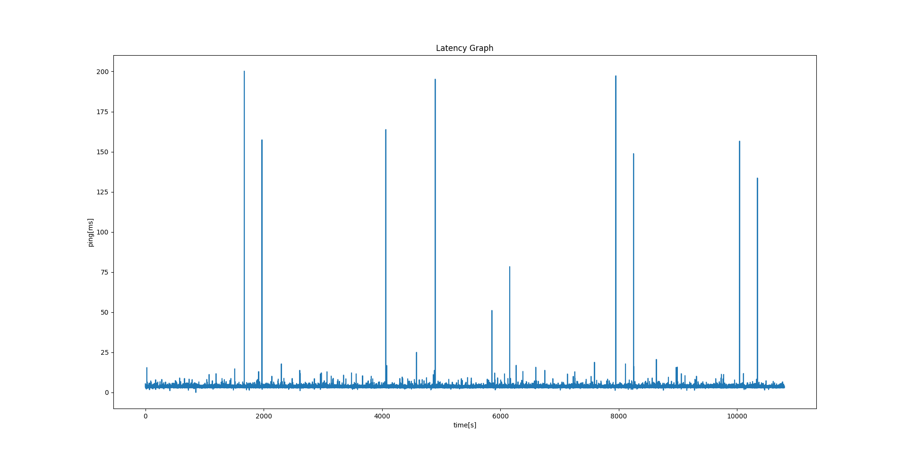

# PingPlus
---
PingPlusはpingコマンドを使いやすくしたい,という意図のもと作成されました.  
### 使用方法
PingPlusは二つのコードで構成されていて,ping.pyとreaddata.pyによって構成されています.  

ping.pyは特定のアドレスにICMPエコー応答を用いて応答時間と時刻を記録します.  
readdata.pyは記録されたデータをグラフとして表示します.
これら二つを用いることで,より長時間の応答時間の確認と瞬時のグラフ化が可能になります.  
またこれらのコマンドを作成するには以下のディレクトリ構造である必要があります.  

```
.
├── data/
|    └──hoge.txt
└── src/
    ├── ping.py
    └── readdata.py
```
---
### 実行例

```bash
python .\main.py
    >> hoge.txt
    >> google.com
    >> 10
```

```bash
python .\readdata.py
    >> hoge.txt
```
